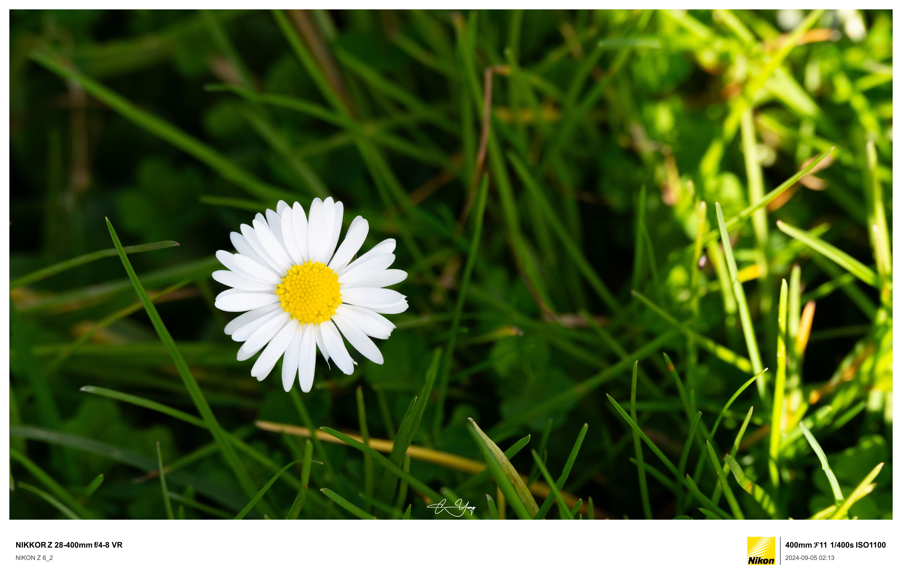
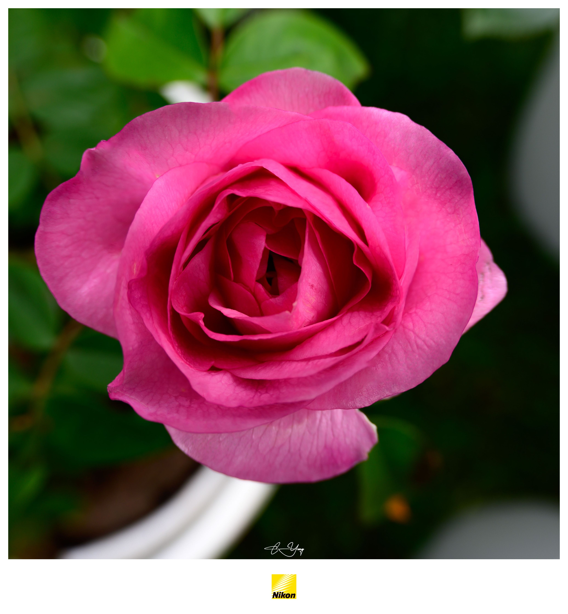
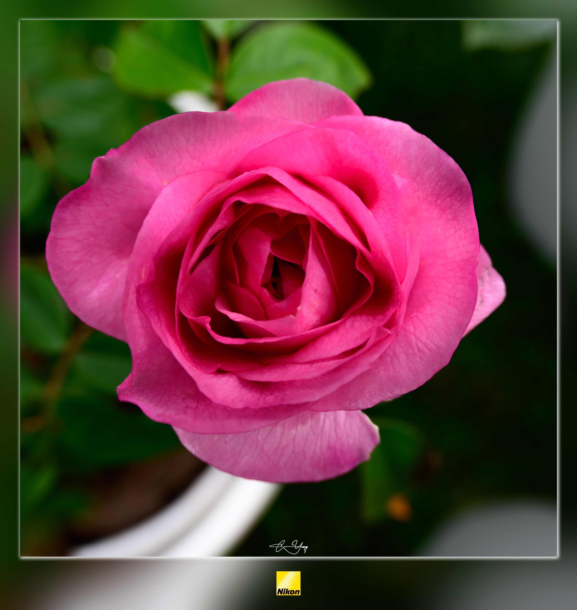
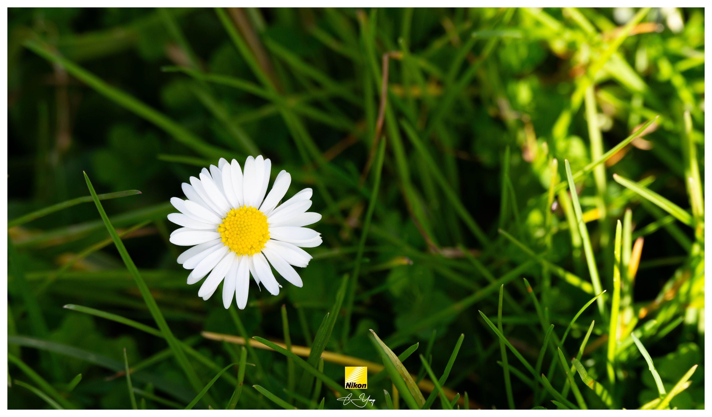
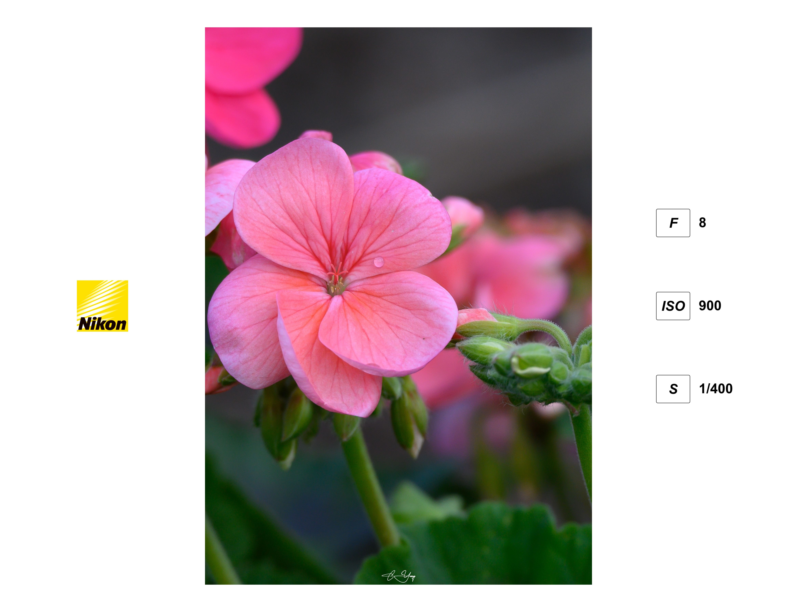
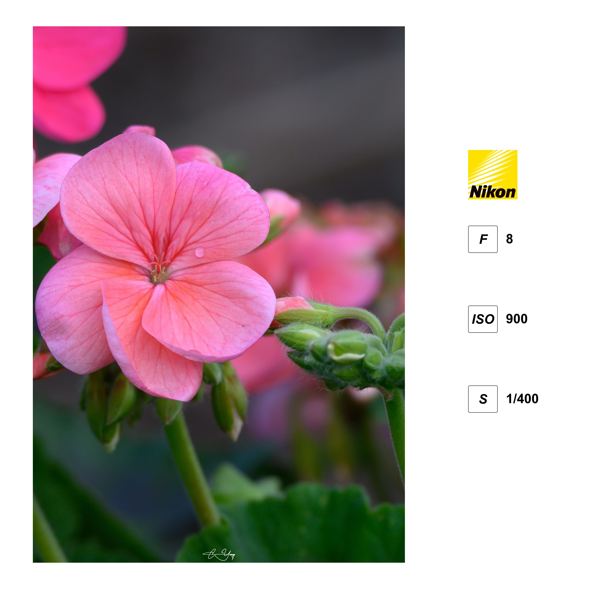

# phew 😮‍💨

aka. **PH**oto **E**xif **W**atermark

A tool to add Exif watermark to photos. The layout can be flexible to define and use different templates.

We use `JSX` to define the watermark templates, render it to `SVG` and composite over the original image.
- no quality loss
- no metadata (EXIF) loss

## Install

Download the released files: 
- `phew.exe`
- `phew.bat`
- `libvips-42.dll`
- `libvips-cpp.dll`

Then you can run `phew.exe` as command.

> If you get errors: `Fail to load Library`, then you can put two `.dll` files to `C:\Windows`.

## Usage

- CLI

```
phew.exe card examples/landscape.jpg -o examples --variation classic
```

- Javascript module

```ts

import { render } from 'phew'

render({
 layout: 'card',
 variation: 'full',
 height: 400, 
}, file, 'dest')

```

- Lightroom

In `Export` dialog, the last section `Post-Pocessing`, select `Open in Other Application...`, choose the bat script `phew.bat` location.

You can edit `phew.bat` as you need to customise the parameters: layout, other tweaks etc.


## Examples


|                    layout / gallery                     |
|:-------------------------------------------------------:|
|                       card / full                       |
|                 |
|                     card / classic                      |
|              |
|                       card / logo                       | 
|                 |
|                      card / clean                       |
|                |
|                   card / clean / blur                   |
|           |
|                      card / param                       |
|                |
|                       card / logo                       |
|             |
|                   card / logo / blur                    |
|        |
|                  card / logo / overlay                  |
|         |
|                      card / param                       |
|                |
|                       card / logo                       |
|             |
|                   card / logo / blur                    |
|        |
|                  card / logo / overlay                  |
|         |
|                                                         |
|                                                         |
|                   expo / around                   |
|       |
|               expo / around / blur                |
|  |
|                    expo / left                    |
|         |
|                   expo / right                    |
|        |
