# phew 😮‍💨

aka. **PH**oto **E**xif **W**atermark

A tool to add Exif watermark to photos. The layout can be flexible to define and use different templates.

We use `JSX` to define the watermark templates, render it to `SVG` and composite over the original image.
- no quality loss
- no metadata (EXIF) loss

## Install

Download the released files: 

Windows:
- `phew.exe`
- `phew.bat`
- `libvips-42.dll`
- `libvips-cpp.dll`

MacOS
- `phew`
- `phew.sh`

Then you can run `phew.exe` or `phew` as command.

> Windows error: 
> If you get errors: `Fail to load Library`, then you can put two `.dll` files to `C:\Windows`.

## Usage

- CLI

```
phew.exe card examples/landscape.jpg -o examples --variation classic
```

- Javascript module

```ts

import { render } from 'phew'

render({
 layout: 'card',
 variation: 'full',
 height: 400, 
}, file, 'dest')

```

- Lightroom

In `Export` dialog, the last section `Post-Pocessing`, select `Open in Other Application...`, choose the bat script `phew.bat` location.

You can edit `phew.bat` as you need to customise the parameters: layout, other tweaks etc.

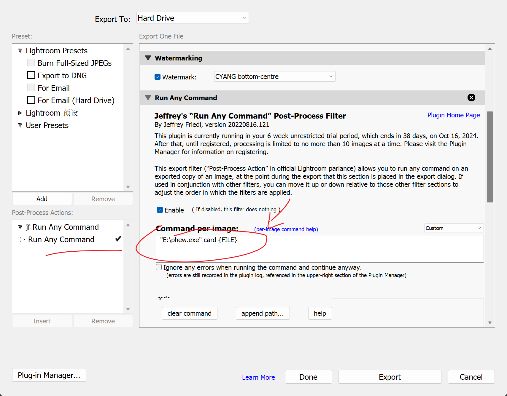


## Watermark

### Single watermark

- Create a `.phew.json` in your home directory

put the config to describe where your watermarks are, you can use different watermark as per the category, a generic is used else.

example config:
```
{
   "watermarks": {
        "generic": {
            "path": "/Users/chao.yang/Pictures/watermark/watermark-generic-light.png",
            "keywords": []
        },
   }
}
```

### Multiple watermarks with AI detection

- start Image Captioning service

```
docker run -p 8004:8004 chaoyangnz/blip-image-captioning-api
```

- Create a `.phew.json` in your home directory

put the config to describe where your watermarks are, you can use different watermark as per the category, a generic is used else.

example config:
```
{
    "captionApi": "http://localhost:8004/caption",
    "watermarks": {
        "generic": {
            "path": "/Users/chao.yang/Pictures/watermark/watermark-generic-light.png",
            "keywords": []
        },
        "astro": {
            "path": "/Users/chao.yang/Pictures/watermark/watermark-astro-light.png",
            "keywords": [
                "star",
                "moon",
                "night",
                "milky way",
                "galaxy",
                "constellation",
                "constellations",
                "constellation",
                "deep sky"
            ]
        },
        "bird": {
            "path": "/Users/chao.yang/Pictures/watermark/watermark-bird-light.png",
            "keywords": [
                "bird",
                "tui",
                "falcon",
                "parrot",
                "penguin"
            ]
        },
        "floral": {
            "path": "/Users/chao.yang/Pictures/watermark/watermark-floral-light.png",
            "keywords": [
                "flower",
                "rose"
            ]
        },
        "seascape": {
            "path": "/Users/chao.yang/Pictures/watermark/watermark-seascape-light.png",
            "keywords": [
                "beach",
                "sea",
                "ocean",
                "bay",
                "cove"
            ]
        },
        "landscape": {
            "path": "/Users/chao.yang/Pictures/watermark/watermark-summit-light.png",
            "keywords": [
                "summit",
                "mountain",
                "peak",
                "hill",
                "peak",
                "waterfall",
                "valley",
                "river",
                "lake",
                "volcano",
                "sunrise",
                "sunset"
            ]
        },
        "cityscape": {
            "path": "/Users/chao.yang/Pictures/watermark/watermark-cityscape-light.png",
            "keywords": [
                "city",
                "building",
                "skyscraper",
                "tower",
                "skyline",
                "sky",
                "tower",
                "skyscraper",
                "skyline"
            ]
        },
        "aircraft": {
            "path": "/Users/chao.yang/Pictures/watermark/watermark-aircraft-light.png",
            "keywords": [
                "airplane",
                "plane",
                "aircraft",
                "airplane"
            ]
        }
    }
}
```

## Examples


|                  layout / gallery                  |
|:--------------------------------------------------:|
|                    card / full                     |
|     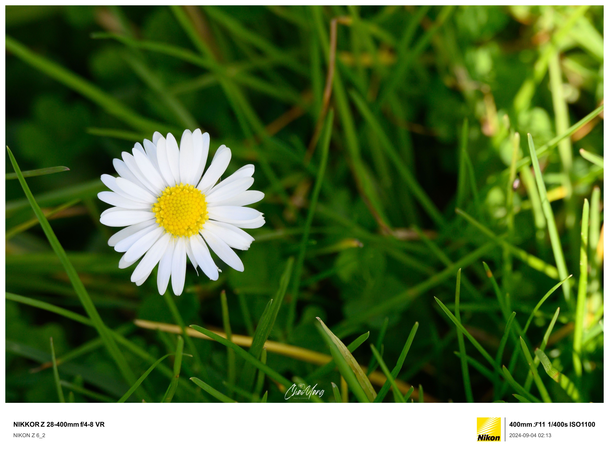     |
|                   card / classic                   |
|   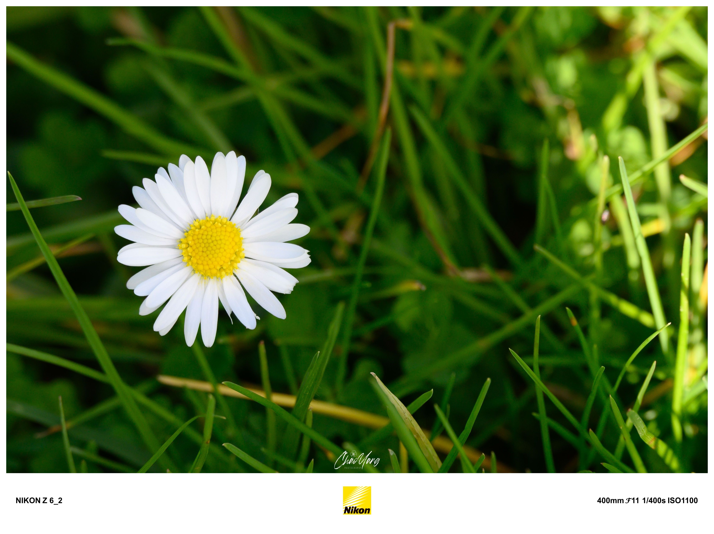    |
|                    card / logo                     | 
|     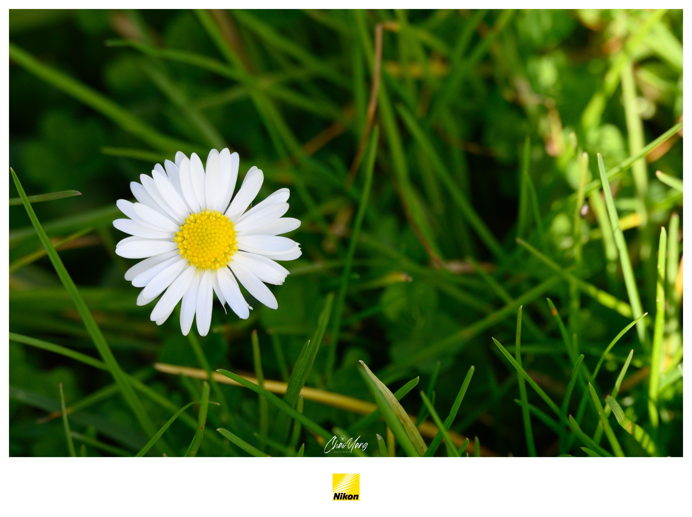     |
|                    card / clean                    |
|    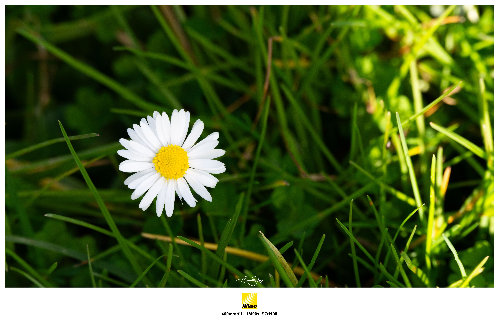     |
|                card / clean / blur                 |
|  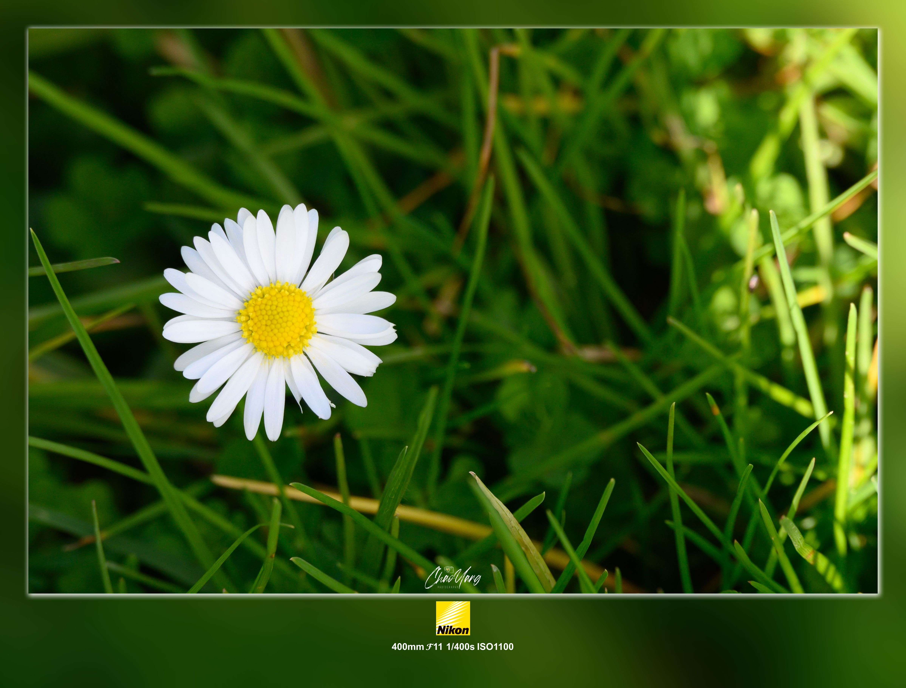  |
|                    card / param                    |
|         |
|                    card / logo                     |
|      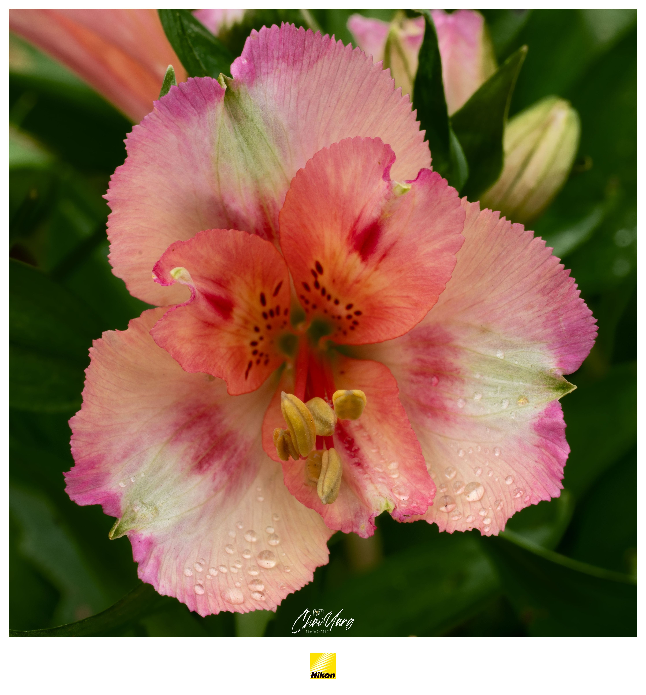       |
|                 card / logo / blur                 |
|    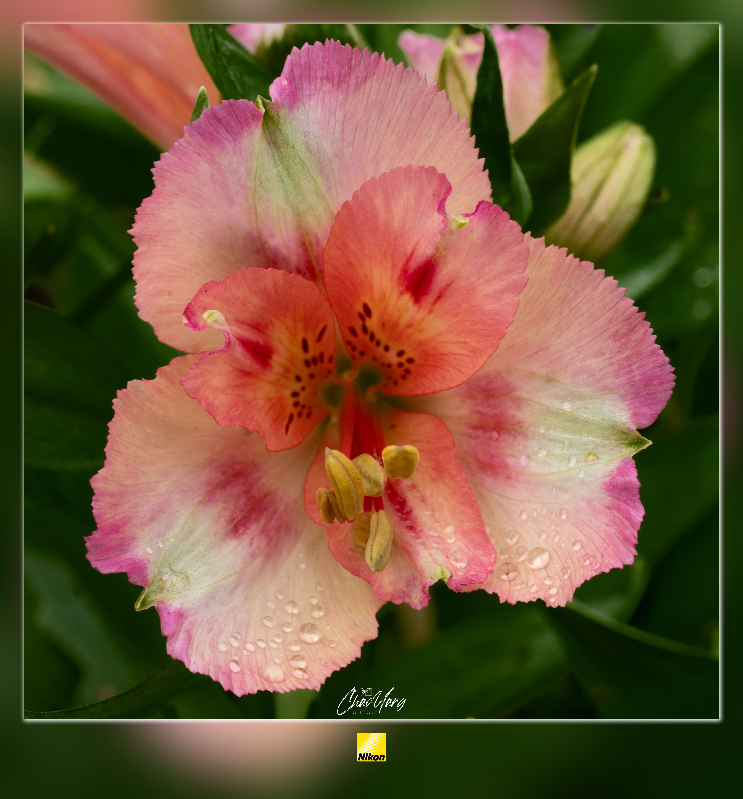    |
|               card / logo / overlay                |
| 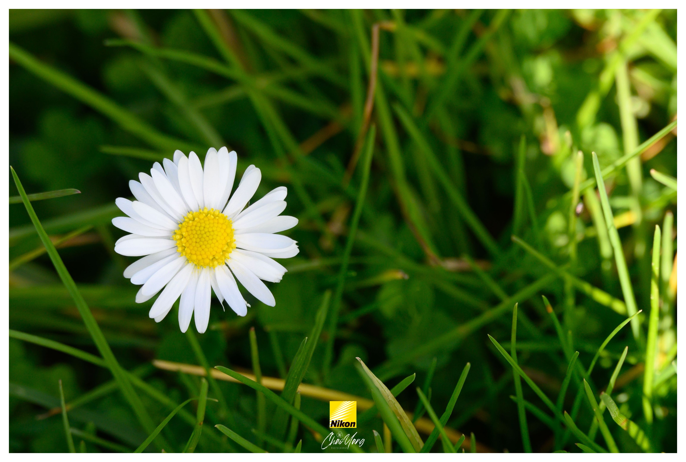 |
|                    card / param                    |
|         |
|                    card / logo                     |
|             |
|                 card / logo / blur                 |
|        |
|               card / logo / overlay                |
|  |
|                    card / frame                    |
|    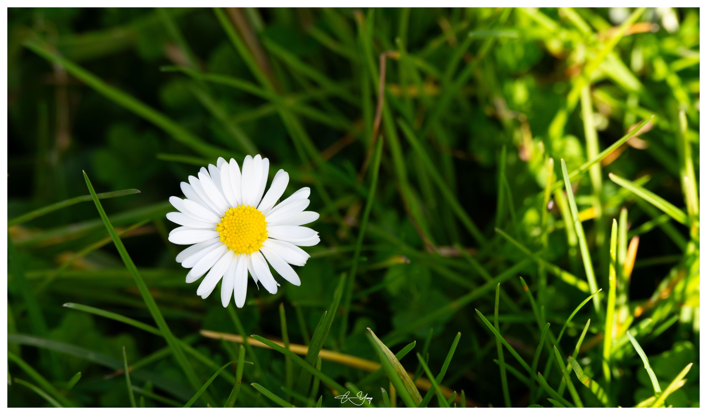     |
|                                                    |
|                                                    |
|                   expo / around                    |
|    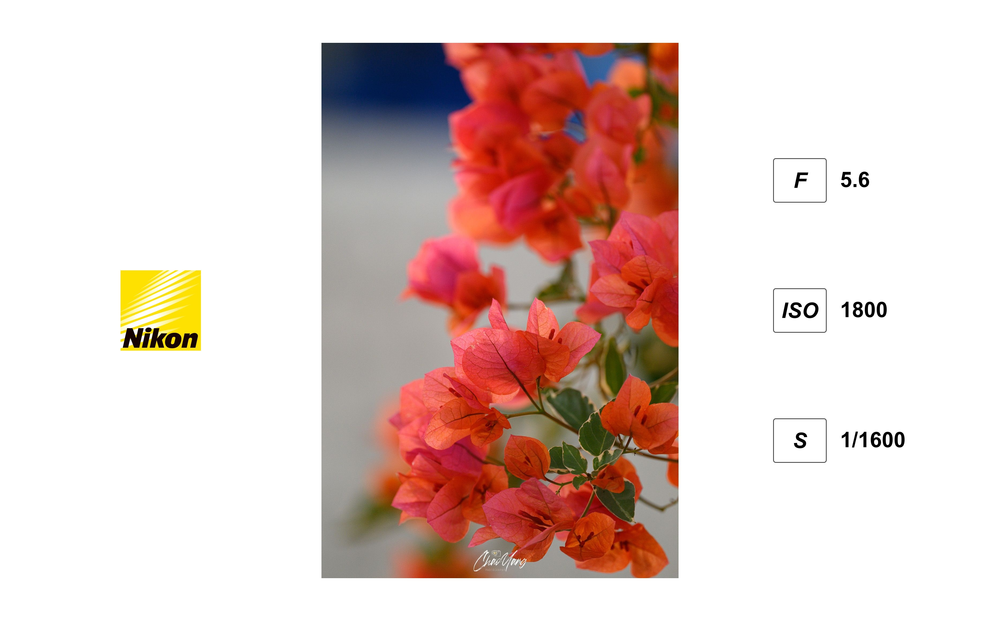     |
|                expo / around / blur                |
|  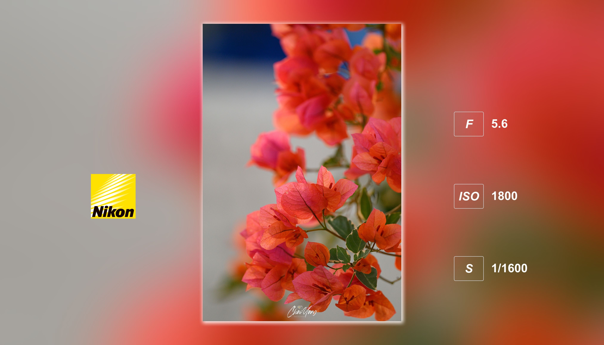  |
|                    expo / left                     |
|     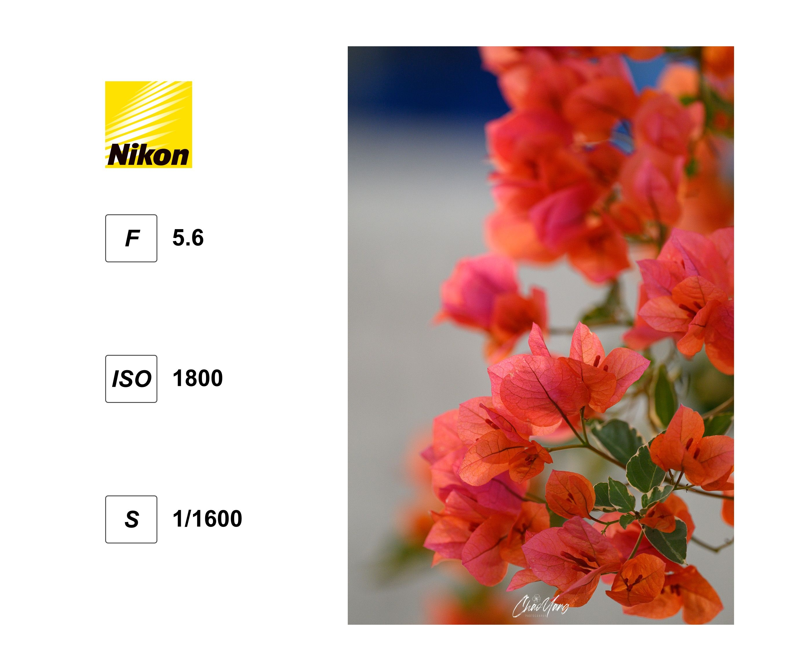      |
|                    expo / right                    |
|     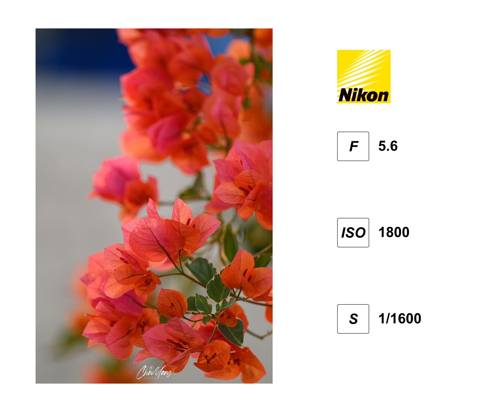     |
